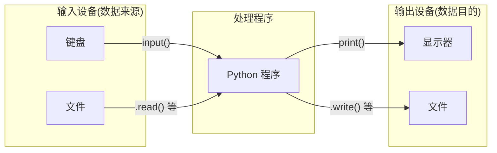
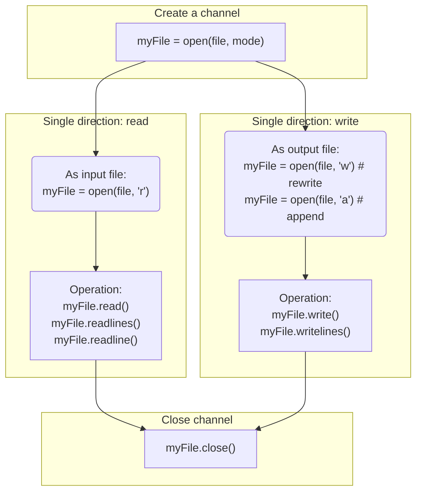

# Python File Handling

[[Python]]

## 文件

为了长期保存数据以便重复使用, 修改和共享, 必须将数据以文件的形式存储到外部存储介质(如磁盘, U 盘, 光盘等)或云盘中.

管理信息系统是使用数据库来存储数据的, 而数据库最终还是要以文件的形式存储到硬盘或其他存储介质上, 应用程序的配置信息往往也是使用文件来存储的, 图形, 图像, 音频, 视频, 可执行文件等等也都是以文件的形式存储在磁盘上的. 因此, 文件操作在各类应用软件的开发中均占有重要的地位.

### 文件的分类

根据文件中数据的组织形式分为：

* 文本文件: `.py`, `.txt`, `.md` 等
    * 储存的是常规字符串, 即记事本或其他文本编辑器能正常显示, 编辑并且人类能够直接阅读和理解的字符串, 如英文字母, 汉字, 数字字符串
* 二进制文件: `.docx`, `.mp3`, `.png` 等
    * 对象内容以字节串 (bytes) 进行存储, 无法用记事本或其他普通字处理软件直接进行编辑, 通常也无法被人类直接阅读和理解, 需要使用专门的软件进行解码后读取, 显示, 修改或执行

## 文本文件操作模型

++ 文本文件操作的本质是**字符串的输入和输出**

### Input-Processing-Output

IPO 是文件信息处理的一般模型

*[IPO]: Input-Processing-Output



### 文件操作步骤



!! 一般来说 "读" 和 "写" 处于两条不能相交的通道, 因此如果先写入的话, 只有执行 `.close()` 后重新 `.open()` 后才能读取内容

## 相关函数与方法

### 打开文件

* 创建通道: 函数 [[Python Functions - open|open]]

### 读取内容

* 方法 `.read()`, 读取整个文件, 返回**一个**字符串
* 方法 `.readline()`, 读取文件第一行, 返回**一个**字符串
* 方法 `.readlines()`, 读取整个文件, 返回一个**列表**, 元素为文件的**每行**构成的字符串
<!--endlist-->

* 以上三个方法都有且仅有一个可选参数 *n*, 填**整数值**
    * 对于 `.read()`, *n* 表示读取文件前 *n* 个字符 (换行符等也算一个字符)
    * 对于 `.readline()`, *n* 表示读取文件第一行前 *n* 个字符, 若超过也只返回第一行
        * 此方法会++记录读取过的行数++, 因此可以循环读取下一行
    * 对于 `.readlines()`, *n* 表示读取文件前 *n* 个字符**涉及**的行, 返回的列表元素为这些行
        * 即文件的第 *n* 字符刚好是第 *i* 行的第一个字符, 则第 *i* 行整行也作为一个字符串, 为返回列表的最后一个元素
* 以上提到的**换行符**规则都在 [[Python Functions - open|open]] 函数中设置
* `.readline` 和 `.readlines` 的 "每行" 都会包含**行末的换行符**
* 对于**大文件**一般使用循环使用 `.realine()` 来读取和处理文件文本, 提高内存利用率

### 写入内容

* 方法 `.write(string)`, 写入**一个字符串** *string*
* 方法 `.writelines(strList)` 写入一个**列表**中 *strList* 的字符串元素
    * 每个字符串元素直接**并联写入**, 相当于 `.write(''.join(strList))`
        * 即 `writelines()` 并不直接分行, 需要手动在每个元素后添加换行符实现分行写入

### 关闭文件

* 方法 `.close()`, 撤销通道

## with Statement

通过 [[Python Statements - with]] 可以免去用 `.close()` 的过程, 文件操作也更直接

## tkinter.filedialog Module

通过 [[Python Modules - tkinter.filedialog]] 来形成**交互式**文件操作过程, 如选择打开文件, 储存路径等

## Examples

### 保存用户多行输入

**Method 1**:

```py
f = open('Inputs.txt', 'w')
s = input()
while s: # 只要用户继续输入就继续写入
    f.write(s + '\n')
    s = input()
f.close()
```

**Method 2**:

```py
linesList = []
s = input()
while s:
    linesList.append(s + '\n') # 先将用户输入全部储存在一个列表里
    s = input()
f = open('Inputs.txt', 'w')
f.writelines(linesList)
f.close()
```

### 行尾行号

```py
src = 'D:\\path\\file.txt'
with open(src, 'r') as f:
    lines = f.readlines()

L = 100 # 设置行末的位置, 要大于现有文本最长行长度
lines = [
    line.rstrip() + ' ' * (L-len(line)) + '#' + str(index) + '\n' \
    for index,line in enumerate(lines, 1)
]

# 写入后缀为 _new 的新文件
with open(src[:-3] + '_new.txt', 'w') as f:
    f.writelines(lines)
```

[//begin]: # "Autogenerated link references for markdown compatibility"
[Python]: Python "Python"
[Python Statements - with]: Python Statements - with "Python Statements - with"
[//end]: # "Autogenerated link references"