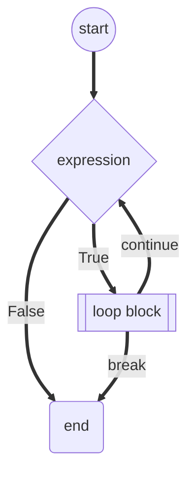
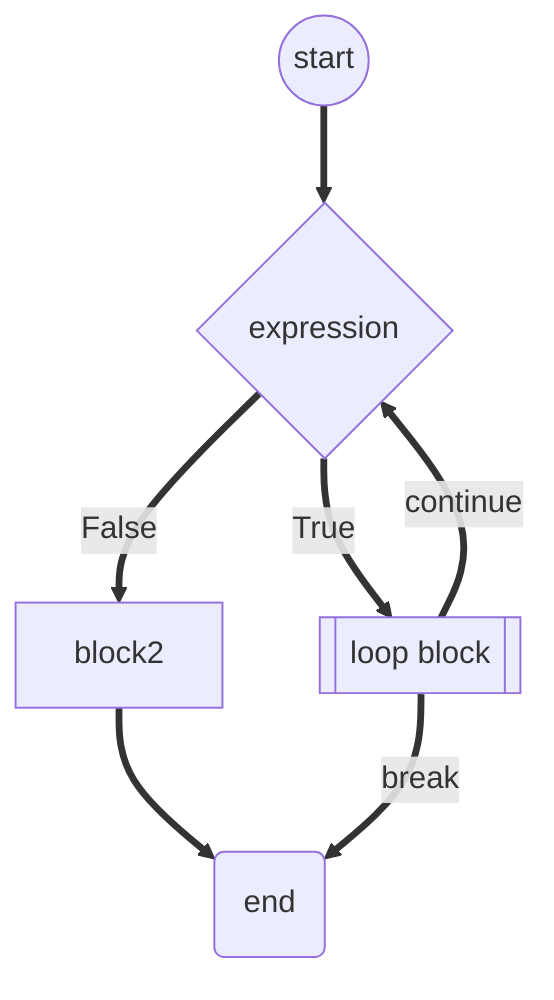

# Python Statements - while

# while 循环

[[Python Statements]] | [[Python Loops]] | [[Python Keywords]]

---

## 语法

```python
while expression:
    loop block
```

或着结合 [[Python Statements - else|else]] 语句

```py
while expression:
    loop block
else:
    block2
```

^2ff17f

!! 这里的 *else* 结构是在循环**自然结束** (即表达式不再成立而非[[Python Statements - break|break]]而结束) 后才执行的

## 流程结构

语法 1:



语法 2:



### 常用结构

* 当无法确定循环次数时, 往往直接使用 *True* 作为表达式, 用 [[Python Statements - break|break]] 结束循环

    ```py
    while True:
        block
        if expression:
            break
    ```

    这里的 *True* 自然可以是其他等价的非零值, 非空值等

[//begin]: # "Autogenerated link references for markdown compatibility"
[Python Statements]: Python Statements "Python Statements"
[Python Loops]: Python Loops "Python Loops"
[Python Keywords]: Python Keywords "Python Keywords"
[//end]: # "Autogenerated link references"